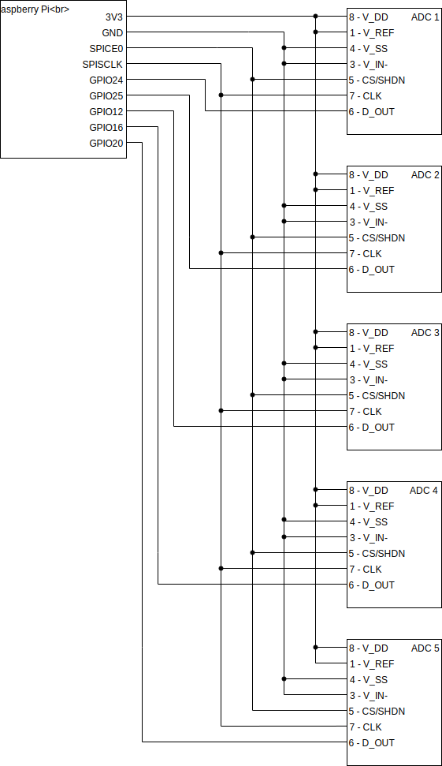

# Forberedelse

## Oppgave 1

## Oppgave 2
  ### a)
  13,5 klokkesykluser behøves for å ta og overføre en punktprøve til RPien. 12 for omgjøringen og 1,5 for samplingen.
  ### b)
  0,806 mV er oppløsningen for ADCen. 3,3V/4096=0,806mV
  ### c)
  Pinnene kan ta en driftspenning på opp til 5,5V, dvs. 2,2V mer enn ved 3,3V.
  
## Oppgave 3
Fordelen med Direct Memory Access er at data kan sendes direkte til minnet fra enheter tilkoblet bussen, istedenfor å sende dataen via prosessoren. Dette gjør at prosessoren ikke forsinker dataen, og at data ikke blir mistet i vente av å bli prosessert.
